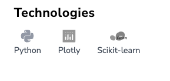
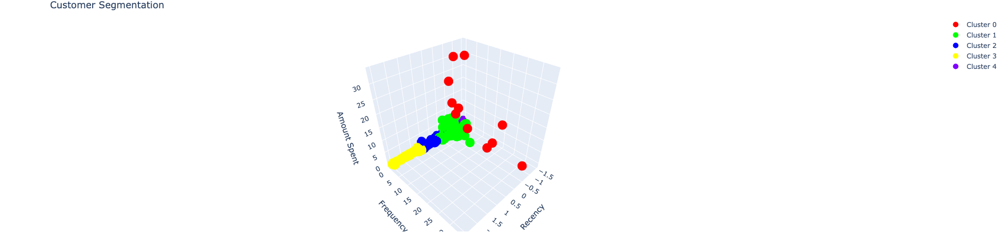

## Project Description

Customer segmentation aims to group customers into segments so businesses can tailor their marketing efforts, refine product offerings, and enhance the overall customer experience. This approach enables companies to move beyond one-size-fits-all strategies and instead deliver targeted and personalized interactions, ultimately leading to increased customer satisfaction and loyalty.

In this project, we’ll attempt the customer segmentation problem using the k-means clustering algorithm. We’ll also visualize the clusters to assess their proximity and interconnectivity. For this project, we’ll use the Online Retail dataset provided by the UCI ML repository. This dataset includes the online purchase history of a UK-based store for its wholesale customers from 2010–2011. Furthermore, the pandas library will be used for data preprocessing tasks, while the scikit-learn and Plotly libraries will serve as the primary tools for data clustering and visualization tasks.

By combining the power of data-driven techniques with the insights gained from customer segmentation, businesses can refine their strategies and foster stronger connections with their customer base. This project will demonstrate the practical application of k-means clustering and showcase the value of leveraging real-world datasets to extract meaningful insights for business decision-making. Through this analysis, we’ll provide a clear roadmap to implement customer segmentation strategies for improved marketing outcomes and customer satisfaction.

## Skills

- Machine Learning

- Data Science

- Data Visualization

## Technologies

## Results

