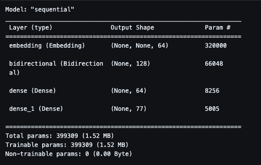
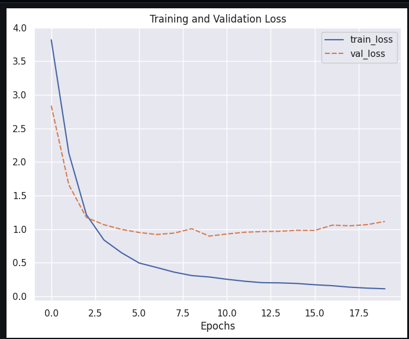
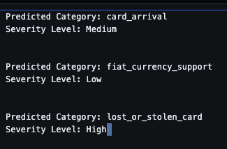

### Project Description

Intent classification is a machine learning process used to identify and classify user intent automatically. It helps in business operations by enabling faster responses to queries and allowing for a more customer-centric support service.

In this project, we will build a natural language processing (NLP) model using TensorFlow for intent classification in a customer support context. The model will be fed with textual data comprising 13,083 customer service queries labeled with 77 intents in a banking domain. The trained NLP model will identify customer intent from questions and automatically categorize them into one of several severity levels (e.g., high, medium, or low). This can help business owners prioritize urgent and high-priority cases, serving as an early warning system to identify potential risks to customer retention. With this information, they can devise timely strategies to win back customers.

[Dataset](https://huggingface.co/datasets/PolyAI/banking77) - Dataset composed of online banking queries annotated with their corresponding intents.

BANKING77 dataset provides a very fine-grained set of intents in a banking domain. It comprises 13,083 customer service queries labeled with 77 intents. It focuses on fine-grained single-domain intent detection.

```py
{
  'label': 11, # integer label corresponding to "card_arrival" intent
  'text': 'I am still waiting on my card?'
}
```

Data Fields

`text`: a string feature.
`label`: One of classification labels (0-76) corresponding to unique intents.


### Skills

- Natural Language Processing

- Data Cleaning

- Data Visualization

- Data Analysis

### Technologies


- Python

- Pandas

- Seaborn

- Tensorflow

### Model 




### Result

Training and Validation loss -



Model's performance with test dataset -

97/97 [==============================] - 2s 12ms/step - loss: 0.8350 - accuracy: 0.8006

### Inference

```py

input_text = ["I am still waiting for my card, when will it arrive?",
                    "Which fiat currency do you support?",
                    "Help, I just lost my card!"]
          
```



-----------------------------x--------------------x--------------------------------------------

